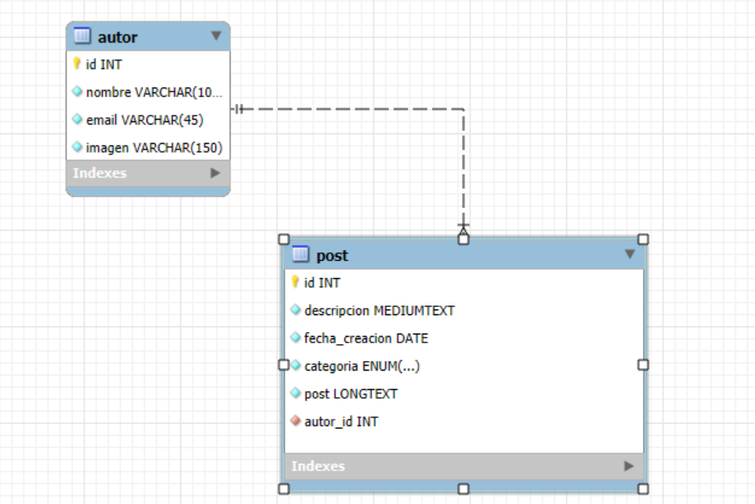

# ACTIVIDAD 8

## Creación de BBDD

La bd se llama **post** y crea dos tablas que se llaman: **post** y **autor**, ademas tienen algunos datos iniciales de autor y post para obtener los gets correspondientes.

## Recuperar todos los autores del blog

GET /api/autores
Body: X
Headers: X

Respuesta:

- Un array con todos los autores del blog
- Si no hay autores, devuelve un array vacio

## Recuperar todos los posts del blog

GET /api/posts
Body: X
Headers: X

Respuesta:

- Un array con todos los posts del blog y los datos de los autores
- Si no hay posts, devuelve un array vacio

## Recuperar todos los posts del blog de un autor_id concreto

Tiene un middleware para comprobar que existe el AUTOR_ID

GET /api/posts/autor/AUTOR_ID
Body: X
Headers: X

Respuesta:

- Un array con todos los posts del blog de un autor concreto
- Si no hay posts de ese autor, devuelve un array vacio

## Insertar un nuevo autor

POST /api/autores
Body: nombre, email, imagen
Headers: X

Respuesta:

- Recibimos un objeto con los datos del nuevo autor creado

# Insertar un nuevo post

POST /api/posts
Body: descripcion, fecha_creaccion, ategoria, post, autor_id
Headers: X

Respuesta:

- Recibimos un objeto con los datos del nuevo post creado
